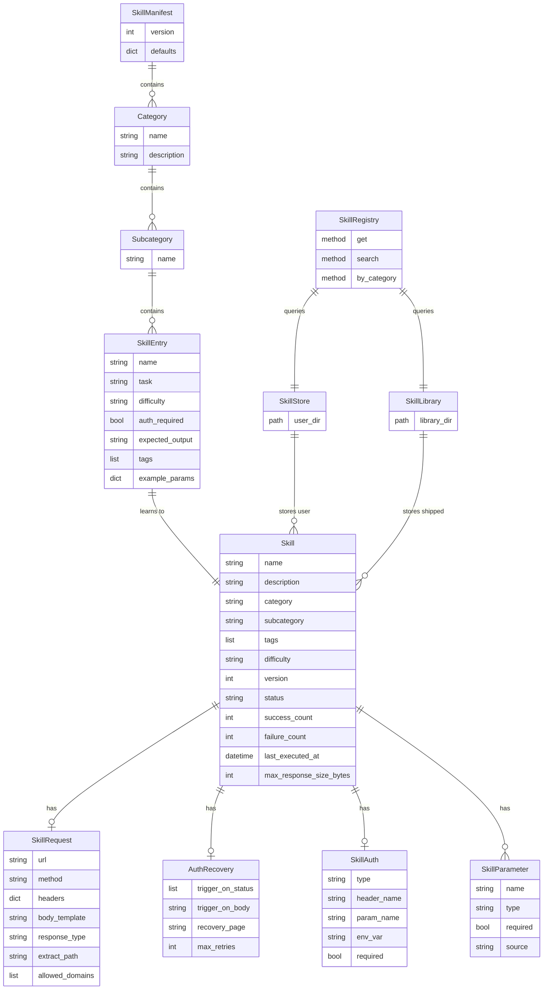

# Skills Library: 150+ Browser Automation Skills

> **Created**: 2025-01-07
> **Refined**: 2025-01-07 (Oracle GPT-5.2 Pro review applied)
> **Status**: Draft
> **Category**: feat
> **Complexity**: A LOT (Major feature)

---

## Overview

Build a comprehensive library of 150+ browser automation skills for mcp-browser-use, covering 8 service categories. This transforms the existing skill system from a "learn one skill at a time" tool into a production-ready skills marketplace.

**Key deliverables:**
1. Skill manifest format with `example_params` for unattended batch learning
2. Batch skill creation pipeline with resume capability
3. Skill categorization, discovery, and dual-source registry (user + library)
4. **Replay-based verification** (not VCR - see Oracle feedback)
5. 150+ verified skills across 8 domains
6. API-key skill support via SkillAuth model

---

## Oracle Review Summary (GPT-5.2 Pro)

**High-Priority Blockers Identified:**

| Issue | Impact | Resolution |
|-------|--------|------------|
| Manifest lacks `example_params` | Batch learning requires manual input | Add seed values to manifest entries |
| VCR incompatible with browser fetch | CDP Runtime.evaluate bypasses Python HTTP | Use replay fixtures, not VCR |
| Header stripping kills API-key skills | VirusTotal, GitHub API won't work | Add SkillAuth model with placeholder detection |
| URL encoding bug in runner.py | `build_url()` vs `request.build_url()` inconsistent | Fix before scaling to 150+ skills |

**Architecture Gaps:**

| Gap | Solution |
|-----|----------|
| No dual-source skills | Add SkillLibrary (read-only shipped) + SkillStore (user-writable) |
| No unified query interface | Add SkillRegistry as unified search surface |
| "Verified" status has no semantics | Define verification = matches expected schema + extract_path works |
| Response size unbounded | Add MAX_RESPONSE_SIZE at JS level |

---

## Problem Statement / Motivation

The current skill system works for individual skills but lacks:
- **No batch creation** - Must create 150+ skills one-by-one manually
- **No categorization** - Skills have name/description only, no taxonomy
- **No testing infrastructure** - Can't verify skills still work after site changes
- **No contribution model** - Local YAML files only, no sharing

Users want a "skill store" they can browse by category (jobs, e-commerce, social media) and trust that skills are verified and maintained.

---

## Proposed Solution

### Phase 1: Skill Infrastructure (Foundation)

Extend skill system with:
- Skill manifest format (YAML catalog of 150+ skill definitions)
- Category/subcategory/tags taxonomy
- Batch learning pipeline
- VCR-based testing fixtures

### Phase 2: Core Skills (80% Coverage)

Create skills for services with low anti-bot friction:
- Developer tools (GitHub, npm, PyPI, Docker Hub)
- Financial data (CoinGecko, Yahoo Finance)
- Public APIs (weather, compliance info)

### Phase 3: Auth & Protected Skills (20% Coverage)

Handle services requiring special handling:
- Session-based auth (LinkedIn, Upwork)
- Anti-bot mitigation strategies
- Rate limit handling

---

## Technical Approach

### Architecture Changes

#### 0. BLOCKER: Fix URL Encoding Bug First

**File**: `src/mcp_server_browser_use/skills/runner.py`

Before scaling to 150+ skills, fix the inconsistent URL encoding:
- `build_url()` function uses one encoding approach
- `SkillRequest.build_url()` method uses different encoding

```python
# BEFORE (inconsistent)
def build_url(template: str, params: dict) -> str:
    # Uses simple string formatting
    
# AFTER (unified)
def build_url(template: str, params: dict, encode: bool = True) -> str:
    """Build URL from template with consistent encoding."""
    result = template
    for key, value in params.items():
        placeholder = f"{{{key}}}"
        encoded_value = urllib.parse.quote(str(value), safe='') if encode else str(value)
        result = result.replace(placeholder, encoded_value)
    return result
```

- [ ] **P0**: Unify URL building to single function
- [ ] Add tests for special characters in params (spaces, unicode, &, =)

#### 1. Extend Skill Model (`models.py`)

```python
# src/mcp_server_browser_use/skills/models.py

@dataclass
class SkillAuth:
    """Authentication configuration for API-key skills."""
    type: Literal["header", "query_param", "bearer"] = "header"
    header_name: str | None = None      # e.g., "X-API-Key"
    param_name: str | None = None       # e.g., "api_key"
    env_var: str | None = None          # e.g., "VIRUSTOTAL_API_KEY"
    required: bool = True

@dataclass
class Skill:
    # ... existing fields ...
    
    # NEW: Categorization
    category: str = ""              # "developer", "jobs", "social", etc.
    subcategory: str = ""           # "github", "npm", "linkedin"
    tags: list[str] = field(default_factory=list)  # ["api", "auth-required"]
    
    # NEW: Rate limiting
    rate_limit_delay_ms: int = 0    # Delay between executions
    last_executed_at: datetime | None = None  # Track for rate limiting
    
    # NEW: Difficulty classification
    difficulty: Literal["easy", "medium", "hard"] = "easy"
    # easy: No auth, no anti-bot
    # medium: Rate limits or session cookies
    # hard: CAPTCHA, aggressive anti-bot
    
    # NEW: API key authentication (Oracle feedback)
    auth: SkillAuth | None = None   # For API-key skills like VirusTotal
    
    # NEW: Response constraints
    max_response_size_bytes: int = 1_000_000  # 1MB default cap
```

#### 2. Skill Manifest Format (Oracle: Add `example_params`)

**CRITICAL**: Manifest entries MUST include `example_params` for unattended batch learning.
Without concrete param values, the agent cannot execute the task autonomously.

```yaml
# examples/skills/manifest.yaml

version: 1
defaults:
  timeout_seconds: 30
  rate_limit_delay_ms: 1000
  max_response_size_bytes: 1000000

categories:
  developer:
    description: "Developer tools and infrastructure"
    subcategories:
      github:
        - name: github-repo-search
          task: "Search GitHub repositories for {query}"
          difficulty: easy
          expected_output: "items[*].full_name"  # JMESPath expression
          example_params:                         # REQUIRED for batch learning
            query: "browser automation python"
          
        - name: github-user-repos
          task: "Get all public repositories for GitHub user {username}"
          difficulty: easy
          expected_output: "[*].name"
          example_params:
            username: "browser-use"
          
      npm:
        - name: npm-package-search
          task: "Search npm packages for {query}"
          difficulty: easy
          expected_output: "objects[*].package.name"
          example_params:
            query: "typescript"
          
        - name: npm-package-info
          task: "Get package details for npm package {package_name}"
          difficulty: easy
          expected_output: "name,version,description"
          example_params:
            package_name: "express"

  jobs:
    description: "Job boards and recruiting"
    subcategories:
      remote:
        - name: remoteok-jobs
          task: "Search RemoteOK for {job_title} jobs"
          difficulty: medium
          expected_output: "[*].position"
          example_params:
            job_title: "software engineer"
          
      salary:
        - name: levels-fyi-salaries
          task: "Get salary data for {role} at {company} from levels.fyi"
          difficulty: medium
          auth_required: false
          expected_output: "salaries[*]"
          example_params:
            role: "software engineer"
            company: "google"

  # API-key skill example (Oracle: SkillAuth support)
  security:
    description: "Security and compliance tools"
    subcategories:
      scanning:
        - name: virustotal-url-scan
          task: "Scan URL {url} with VirusTotal"
          difficulty: medium
          expected_output: "data.attributes.stats"
          example_params:
            url: "https://example.com"
          auth:
            type: header
            header_name: "x-apikey"
            env_var: "VIRUSTOTAL_API_KEY"
            required: true
          tags: ["api-key-required"]
```

#### 3. Batch Learning Pipeline

```python
# src/mcp_server_browser_use/skills/batch.py

@dataclass
class BatchLearningResult:
    total: int
    succeeded: int
    failed: int
    skipped: int
    results: list[SkillLearningResult]

class SkillBatchLearner:
    """Batch skill creation from manifest."""
    
    def __init__(
        self,
        manifest_path: Path,
        output_dir: Path,
        llm: BaseChatModel,
        browser_config: BrowserConfig,
    ):
        self.manifest = self._load_manifest(manifest_path)
        self.output_dir = output_dir
        self.llm = llm
        self.browser_config = browser_config
    
    async def learn_all(
        self,
        categories: list[str] | None = None,
        skip_auth_required: bool = True,
        skip_hard_difficulty: bool = True,
        delay_between_skills_ms: int = 5000,
    ) -> BatchLearningResult:
        """Learn all skills from manifest."""
        results = []
        
        for skill_def in self._filter_skills(categories, skip_auth_required, skip_hard_difficulty):
            try:
                result = await self._learn_single(skill_def)
                results.append(result)
                
                if result.success:
                    await self._save_skill(result.skill)
                    
            except Exception as e:
                results.append(SkillLearningResult(
                    name=skill_def.name,
                    success=False,
                    error=str(e),
                ))
            
            # Rate limit protection
            await asyncio.sleep(delay_between_skills_ms / 1000)
        
        return self._compile_results(results)
```

#### 4. Replay-Based Verification (Oracle: VCR Won't Work)

**Why VCR doesn't work:** Skills execute `fetch()` via CDP `Runtime.evaluate` inside the browser.
VCR intercepts Python HTTP requests, but browser fetch bypasses Python entirely.

**Solution:** Replay fixtures that test the parsing/extraction logic, not network calls.

```python
# src/mcp_server_browser_use/skills/verifier.py

@dataclass
class VerificationResult:
    skill_name: str
    passed: bool
    extract_path_valid: bool
    output_matches_schema: bool
    error: str | None = None

class SkillVerifier:
    """Verify skills against recorded response fixtures."""
    
    def __init__(self, fixtures_dir: Path):
        self.fixtures_dir = fixtures_dir
    
    async def verify(self, skill: Skill) -> VerificationResult:
        """Verify skill parsing against stored fixture."""
        fixture_path = self.fixtures_dir / skill.category / f"{skill.name}.json"
        
        if not fixture_path.exists():
            return VerificationResult(
                skill_name=skill.name,
                passed=False,
                extract_path_valid=False,
                output_matches_schema=False,
                error="No fixture found"
            )
        
        fixture_data = json.loads(fixture_path.read_text())
        
        # Test extract_path works on stored response
        try:
            if skill.request and skill.request.extract_path:
                result = jmespath.search(skill.request.extract_path, fixture_data)
                extract_valid = result is not None and len(result) > 0
            else:
                extract_valid = True
        except Exception as e:
            return VerificationResult(
                skill_name=skill.name,
                passed=False,
                extract_path_valid=False,
                output_matches_schema=False,
                error=f"JMESPath error: {e}"
            )
        
        return VerificationResult(
            skill_name=skill.name,
            passed=extract_valid,
            extract_path_valid=extract_valid,
            output_matches_schema=True,  # Future: add schema validation
        )
```

```python
# tests/fixtures/conftest.py

import pytest
from pathlib import Path

FIXTURES_DIR = Path(__file__).parent

@pytest.fixture
def replay_fixture():
    """Load pre-recorded API response for replay testing."""
    def _load(category: str, skill_name: str) -> dict:
        path = FIXTURES_DIR / "responses" / category / f"{skill_name}.json"
        return json.loads(path.read_text())
    return _load

@pytest.fixture
def skill_verifier():
    """Verifier instance for testing."""
    from mcp_server_browser_use.skills.verifier import SkillVerifier
    return SkillVerifier(FIXTURES_DIR / "responses")
```

```
tests/
├── fixtures/
│   ├── responses/           # Recorded API responses (not VCR)
│   │   ├── developer/
│   │   │   ├── github-repo-search.json
│   │   │   └── npm-package-search.json
│   │   └── jobs/
│   │       └── remoteok-jobs.json
│   └── conftest.py
├── test_skills_replay.py    # Replay-based verification tests
└── test_skills_batch.py     # Batch learning tests
```

**Recording Fixtures:**
After learning a skill, save the raw API response:
```bash
# During batch learning, save responses
mcp-server-browser-use skills learn-batch --save-fixtures tests/fixtures/responses/
```

---

## Implementation Phases

### Phase 0: Blockers (BEFORE Week 1)

**These must be fixed before any skill scaling work.**

#### 0.1 Fix URL Encoding Bug

**File**: `src/mcp_server_browser_use/skills/runner.py`

- [ ] **P0**: Audit `build_url()` function vs `SkillRequest.build_url()` method
- [ ] Unify to single URL building function with consistent encoding
- [ ] Add tests for special characters: spaces, unicode, `&`, `=`, `#`
- [ ] Test: `{query}` = "react & vue" should encode properly

#### 0.2 Add Response Size Cap

**File**: `src/mcp_server_browser_use/skills/runner.py`

- [ ] Add `MAX_RESPONSE_SIZE = 1_000_000` (1MB) constant
- [ ] Truncate response in JS fetch before returning to Python
- [ ] Prevents OOM on huge API responses when running 150+ skills

---

### Phase 1: Foundation (Week 1)

#### 1.1 Extend Skill Model

**File**: `src/mcp_server_browser_use/skills/models.py`

```python
# Add SkillAuth for API-key skills
@dataclass
class SkillAuth:
    type: Literal["header", "query_param", "bearer"] = "header"
    header_name: str | None = None
    param_name: str | None = None
    env_var: str | None = None
    required: bool = True

# Add to Skill dataclass
category: str = ""
subcategory: str = ""  
tags: list[str] = field(default_factory=list)
difficulty: Literal["easy", "medium", "hard"] = "easy"
rate_limit_delay_ms: int = 0
last_executed_at: datetime | None = None
auth_required: bool = False
auth: SkillAuth | None = None
max_response_size_bytes: int = 1_000_000
```

- [ ] Add SkillAuth dataclass for API-key skills
- [ ] Add category, subcategory, tags fields to Skill
- [ ] Add difficulty classification
- [ ] Add rate_limit_delay_ms field + last_executed_at tracking
- [ ] Add auth field for API-key configuration
- [ ] Add max_response_size_bytes field
- [ ] Update YAML serialization in store.py
- [ ] Add validation for category values
- [ ] Update tests

#### 1.2 Create Skill Manifest Schema

**File**: `src/mcp_server_browser_use/skills/manifest.py`

```python
from pydantic import BaseModel

class SkillManifestEntry(BaseModel):
    name: str
    task: str
    difficulty: Literal["easy", "medium", "hard"] = "easy"
    auth_required: bool = False
    expected_output: str | None = None
    tags: list[str] = []
    rate_limit_delay_ms: int = 1000

class SkillManifest(BaseModel):
    version: int = 1
    defaults: dict[str, Any] = {}
    categories: dict[str, CategoryDefinition]
    
    def iter_skills(self) -> Iterator[tuple[str, str, SkillManifestEntry]]:
        """Yield (category, subcategory, skill_entry) tuples."""
        for cat_name, cat_def in self.categories.items():
            for subcat_name, skills in cat_def.subcategories.items():
                for skill in skills:
                    yield cat_name, subcat_name, skill
```

- [ ] Create Pydantic models for manifest schema
- [ ] Add manifest loader with validation
- [ ] Add skill iterator by category
- [ ] Add filtering methods (by difficulty, auth, category)
- [ ] Write unit tests for manifest parsing

#### 1.3 Add Skill Registry (Oracle: Dual-Source Architecture)

**File**: `src/mcp_server_browser_use/skills/registry.py`

The system needs TWO skill sources with a unified query interface:

```python
class SkillLibrary:
    """Read-only shipped skills (bundled with package)."""
    
    def __init__(self, library_dir: Path):
        self.library_dir = library_dir  # e.g., src/mcp_server_browser_use/skills/library/
        self._index: dict[str, Skill] = {}
    
    def load(self) -> None:
        """Load all shipped skills (called once at startup)."""
        for yaml_path in self.library_dir.glob("**/*.yaml"):
            skill = Skill.from_yaml(yaml_path.read_text())
            self._index[skill.name] = skill

class SkillRegistry:
    """Unified query interface across user skills + library skills."""
    
    def __init__(self, store: SkillStore, library: SkillLibrary):
        self.store = store      # User-created skills (~/.config/browser-skills/)
        self.library = library  # Shipped skills (read-only)
    
    def get(self, name: str) -> Skill | None:
        """Get skill by name. User skills shadow library skills."""
        return self.store.load(name) or self.library.get(name)
    
    def search(
        self,
        query: str = "",
        category: str | None = None,
        difficulty: str | None = None,
        tags: list[str] | None = None,
    ) -> list[Skill]:
        """Search across all skills."""
        # Combine results, user skills take precedence
    
    def by_category(self, category: str) -> list[Skill]:
        """Get all skills in a category."""
```

- [ ] Create SkillLibrary class for read-only shipped skills
- [ ] Create SkillRegistry as unified query interface
- [ ] User skills shadow library skills (same name = user wins)
- [ ] Add `skill_search` MCP tool using registry
- [ ] Add `skill_categories` MCP tool using registry

#### 1.4 Implement Batch Learner

**File**: `src/mcp_server_browser_use/skills/batch.py`

- [ ] Create SkillBatchLearner class
- [ ] **CRITICAL**: Use `example_params` from manifest to populate task
- [ ] Implement learn_all() with filtering
- [ ] Add delay between skills (rate limit protection)
- [ ] Add progress callback for monitoring
- [ ] Add resume capability (skip already-learned skills)
- [ ] Stamp metadata (category, subcategory, tags) onto learned skills
- [ ] Generate summary report
- [ ] **Save response fixtures** for replay verification
- [ ] Add CLI command: `mcp-server-browser-use skills learn-batch`

#### 1.5 Add Replay Test Infrastructure (NOT VCR)

**File**: `src/mcp_server_browser_use/skills/verifier.py`

- [ ] Create SkillVerifier class
- [ ] Implement verify() with JMESPath validation
- [ ] Add fixture loading from responses directory
- [ ] Add CLI command: `mcp-server-browser-use skills verify`
- [ ] Create fixtures directory structure
- [ ] Implement replay_fixture pytest fixture
- [ ] Write test_skills_replay.py with example test

---

### Phase 2: Core Skills - Developer & Finance (Week 2)

#### 2.1 Developer Tools (30 skills)

| Service | Skills | Difficulty | Auth |
|---------|--------|------------|------|
| GitHub | repo-search, user-repos, user-profile, repo-contributors, repo-issues, actions-pricing | easy | No |
| npm | package-search, package-info, package-downloads | easy | No |
| PyPI | package-search, package-info, package-releases | easy | No |
| Docker Hub | image-search, image-tags, image-info | easy | No |
| Hugging Face | model-search, model-info, dataset-search | easy | No |
| Replit | templates-list | medium | No |

```yaml
# examples/skills/manifest.yaml - Developer section

developer:
  description: "Developer tools and infrastructure"
  subcategories:
    github:
      - name: github-repo-search
        task: "Search GitHub repositories for {query}"
        difficulty: easy
        expected_output: "items[*].full_name"
        
      - name: github-user-profile
        task: "Get GitHub profile for user {username}"
        difficulty: easy
        expected_output: "login,name,bio,public_repos"
        
      - name: github-repo-contributors
        task: "Get top contributors for GitHub repo {owner}/{repo}"
        difficulty: easy
        expected_output: "[*].login"
        
      - name: github-actions-pricing
        task: "Get GitHub Actions pricing and limits"
        difficulty: easy
        expected_output: "pricing tiers"

    npm:
      - name: npm-package-search
        task: "Search npm packages for {query}"
        difficulty: easy
        expected_output: "objects[*].package.name"
        
      - name: npm-package-info
        task: "Get npm package details for {package}"
        difficulty: easy
        expected_output: "name,version,description,dependencies"
        
      - name: npm-package-downloads
        task: "Get download stats for npm package {package}"
        difficulty: easy
        expected_output: "downloads"

    pypi:
      - name: pypi-package-search
        task: "Search PyPI packages for {query}"
        difficulty: easy
        expected_output: "[*].name"
        
      - name: pypi-package-info
        task: "Get PyPI package info for {package}"
        difficulty: easy
        expected_output: "info.name,info.version,info.summary"

    docker:
      - name: dockerhub-image-search
        task: "Search Docker Hub for images matching {query}"
        difficulty: easy
        expected_output: "results[*].name"
        
      - name: dockerhub-image-tags
        task: "Get available tags for Docker image {image}"
        difficulty: easy
        expected_output: "results[*].name"

    huggingface:
      - name: hf-model-search
        task: "Search Hugging Face models for {query}"
        difficulty: easy
        expected_output: "[*].modelId"
        
      - name: hf-model-info
        task: "Get Hugging Face model info for {model_id}"
        difficulty: easy
        expected_output: "modelId,downloads,likes"
```

- [ ] Create developer skills manifest section
- [ ] Run batch learning for GitHub skills
- [ ] Run batch learning for npm skills  
- [ ] Run batch learning for PyPI skills
- [ ] Run batch learning for Docker Hub skills
- [ ] Run batch learning for Hugging Face skills
- [ ] Record VCR cassettes for each
- [ ] Verify all skills work with test execution

#### 2.2 Cloud Pricing (15 skills)

| Service | Skills | Difficulty | Auth |
|---------|--------|------------|------|
| Vercel | pricing-tiers | easy | No |
| Netlify | pricing-info | easy | No |
| Railway | pricing-info | easy | No |
| Render | pricing-tiers | easy | No |
| Fly.io | pricing-info | easy | No |
| MongoDB Atlas | pricing-tiers | easy | No |
| PlanetScale | pricing-info | easy | No |
| Neon | pricing-tiers | easy | No |
| Clerk | pricing-info | easy | No |
| Cloudflare | pricing-workers, pricing-pages | easy | No |
| Sentry | pricing-tiers | easy | No |

- [ ] Create cloud-pricing manifest section
- [ ] Run batch learning for PaaS pricing
- [ ] Run batch learning for DB pricing
- [ ] Run batch learning for auth/tools pricing
- [ ] Record VCR cassettes
- [ ] Verify skills

#### 2.3 Financial Data (20 skills)

| Service | Skills | Difficulty | Auth |
|---------|--------|------------|------|
| CoinGecko | coin-price, coin-info, trending-coins | easy | No |
| Yahoo Finance | stock-quote, stock-info | easy | No |
| Polymarket | trending-markets, market-info | easy | No |
| Crunchbase | company-search (limited) | medium | Partial |
| XE | exchange-rate | easy | No |

- [ ] Create financial manifest section
- [ ] Run batch learning for crypto skills
- [ ] Run batch learning for stock skills
- [ ] Run batch learning for market skills
- [ ] Record VCR cassettes
- [ ] Verify skills

---

### Phase 3: Core Skills - Jobs, E-Commerce, Travel (Week 3)

#### 3.1 Job Boards (25 skills)

| Service | Skills | Difficulty | Auth |
|---------|--------|------------|------|
| RemoteOK | job-search, job-categories | easy | No |
| Levels.fyi | salary-search, company-salaries | medium | No |
| Totaljobs UK | job-search | medium | No |
| Seek Australia | job-search | medium | No |
| HeadHunter (hh.ru) | job-search | medium | No |
| Indeed | job-search | hard | Anti-bot |
| LinkedIn Jobs | job-search | hard | Auth |

```yaml
jobs:
  description: "Job boards and salary data"
  subcategories:
    remote:
      - name: remoteok-job-search
        task: "Search RemoteOK for {job_title} remote jobs"
        difficulty: easy
        expected_output: "[*].position"
        
      - name: remoteok-categories
        task: "Get job categories from RemoteOK"
        difficulty: easy
        expected_output: "categories"

    salary:
      - name: levelsfyi-salary-search
        task: "Search levels.fyi for {role} salaries"
        difficulty: medium
        expected_output: "salaries[*]"
        rate_limit_delay_ms: 3000
        
      - name: levelsfyi-company-salaries
        task: "Get salary data for {company} from levels.fyi"
        difficulty: medium
        expected_output: "levels,salaries"
        rate_limit_delay_ms: 3000

    general:
      - name: totaljobs-search
        task: "Search Totaljobs UK for {job_title} in {location}"
        difficulty: medium
        expected_output: "jobs[*].title"
        
      - name: seek-australia-search
        task: "Search Seek Australia for {job_title} jobs"
        difficulty: medium
        expected_output: "[*].title"
```

- [ ] Create jobs manifest section
- [ ] Run batch learning for RemoteOK (easy)
- [ ] Run batch learning for Levels.fyi (medium, rate limited)
- [ ] Run batch learning for regional job boards
- [ ] Skip auth-required boards (LinkedIn, Indeed) for now
- [ ] Record VCR cassettes
- [ ] Verify skills

#### 3.2 E-Commerce (20 skills)

| Service | Skills | Difficulty | Auth |
|---------|--------|------------|------|
| Amazon | product-search, product-price | hard | CAPTCHA |
| eBay | product-search | medium | No |
| Instacart | store-search | medium | No |
| Slickdeals | hot-deals | easy | No |
| RockAuto | parts-search | medium | No |
| Yandex Market | product-search | medium | No |

- [ ] Create ecommerce manifest section
- [ ] Run batch learning for Slickdeals (easy)
- [ ] Run batch learning for eBay (medium)
- [ ] Run batch learning for specialty stores
- [ ] Document Amazon limitations (CAPTCHA)
- [ ] Record VCR cassettes
- [ ] Verify skills

#### 3.3 Travel & Transport (20 skills)

| Service | Skills | Difficulty | Auth |
|---------|--------|------------|------|
| TripAdvisor | attraction-search, hotel-search | medium | Anti-bot |
| AllTrails | trail-search, trail-info | easy | No |
| Klook | activity-search | medium | No |
| Headout | listing-search | medium | No |
| Aviasales | flight-search | medium | No |
| Greyhound | schedule-search | easy | No |

- [ ] Create travel manifest section
- [ ] Run batch learning for AllTrails (easy)
- [ ] Run batch learning for activity sites
- [ ] Run batch learning for transport
- [ ] Document anti-bot sites
- [ ] Record VCR cassettes
- [ ] Verify skills

---

### Phase 4: Core Skills - Social, SEO, Compliance (Week 4)

#### 4.1 Social Media (25 skills)

| Service | Skills | Difficulty | Auth |
|---------|--------|------------|------|
| YouTube | video-search, playlist-info, channel-info | easy | No |
| Reddit | subreddit-posts, user-posts | medium | No |
| Hacker News | top-posts, new-posts | easy | No |
| Mastodon | trending-posts | easy | No |
| TikTok | trending-videos | hard | Anti-bot |
| Instagram | profile-posts | hard | Auth |
| LinkedIn | company-posts | hard | Auth |

```yaml
social:
  description: "Social media platforms"
  subcategories:
    video:
      - name: youtube-video-search
        task: "Search YouTube videos for {query}"
        difficulty: easy
        expected_output: "items[*].snippet.title"
        
      - name: youtube-playlist-info
        task: "Get YouTube playlist info for {playlist_id}"
        difficulty: easy
        expected_output: "items[*].snippet.title"
        
      - name: youtube-channel-info
        task: "Get YouTube channel info for {channel_id}"
        difficulty: easy
        expected_output: "title,subscriberCount,videoCount"

    forums:
      - name: reddit-subreddit-posts
        task: "Get top posts from subreddit r/{subreddit}"
        difficulty: medium
        expected_output: "data.children[*].data.title"
        rate_limit_delay_ms: 2000
        
      - name: hackernews-top-posts
        task: "Get top {count} posts from Hacker News"
        difficulty: easy
        expected_output: "[*].title"
        
      - name: mastodon-trending
        task: "Get trending posts from {instance} Mastodon instance"
        difficulty: easy
        expected_output: "[*].content"

    restricted:
      - name: tiktok-trending
        task: "Get trending TikTok videos"
        difficulty: hard
        auth_required: false
        tags: ["anti-bot", "may-fail"]
        
      - name: instagram-profile
        task: "Get Instagram profile for {username}"
        difficulty: hard
        auth_required: true
        tags: ["auth-required", "rate-limited"]
```

- [ ] Create social manifest section
- [ ] Run batch learning for YouTube (easy)
- [ ] Run batch learning for Reddit (medium, rate limited)
- [ ] Run batch learning for Hacker News (easy)
- [ ] Run batch learning for Mastodon (easy)
- [ ] Document hard skills (TikTok, Instagram, LinkedIn)
- [ ] Record VCR cassettes
- [ ] Verify skills

#### 4.2 SEO & Search (15 skills)

| Service | Skills | Difficulty | Auth |
|---------|--------|------------|------|
| Google Trends | trending-keywords | medium | No |
| AlsoAsked | question-tree | medium | No |
| Chrome Web Store | extension-search | easy | No |
| Wikipedia | infobox-extract | easy | No |
| Pexels | video-search | easy | No |

- [ ] Create seo manifest section
- [ ] Run batch learning for public tools
- [ ] Document SEMrush limitations (paid auth)
- [ ] Record VCR cassettes
- [ ] Verify skills

#### 4.3 Legal & Compliance (15 skills)

| Service | Skills | Difficulty | Auth |
|---------|--------|------------|------|
| CVE Database | vulnerability-search | easy | No |
| VirusTotal | url-scan | medium | API key |
| GDPR info | compliance-info | easy | No |
| CCPA info | compliance-info | easy | No |
| HIPAA info | compliance-info | easy | No |
| SOC 2 info | compliance-info | easy | No |

- [ ] Create compliance manifest section
- [ ] Run batch learning for public compliance info
- [ ] Document VirusTotal API key requirement
- [ ] Record VCR cassettes
- [ ] Verify skills

---

### Phase 5: Utility & Weather Skills (Week 5)

#### 5.1 Weather & Environment (10 skills)

| Service | Skills | Difficulty | Auth |
|---------|--------|------------|------|
| Weather Underground | forecast | easy | No |
| Windy | forecast | easy | No |
| AirNow | air-quality | easy | No |
| Pollen.com | pollen-forecast | easy | No |
| NOAA | weather-data | easy | No |

- [ ] Create weather manifest section
- [ ] Run batch learning for weather skills
- [ ] Record VCR cassettes
- [ ] Verify skills

#### 5.2 Productivity (10 skills)

| Service | Skills | Difficulty | Auth |
|---------|--------|------------|------|
| Doodle | poll-create | medium | No |
| Zoom | pricing-info | easy | No |
| Google Calendar | event-create | hard | Auth |
| Gmail | email-list | hard | Auth |

- [ ] Create productivity manifest section
- [ ] Run batch learning for public tools
- [ ] Document auth-required skills
- [ ] Record VCR cassettes
- [ ] Verify skills

#### 5.3 Miscellaneous (10 skills)

| Service | Skills | Difficulty | Auth |
|---------|--------|------------|------|
| Mega Millions | results | easy | No |
| FanDuel | odds | medium | No |
| DraftKings | odds | medium | No |
| Statista | data-search | medium | Partial |
| Census | data-search | easy | No |

- [ ] Create misc manifest section
- [ ] Run batch learning
- [ ] Record VCR cassettes
- [ ] Verify skills

---

### Phase 6: Documentation & Polish (Week 6)

#### 6.1 Skill Registry MCP Tools

Add new MCP tools for skill discovery:

```python
@server.tool()
async def skill_search(
    query: str = "",
    category: str | None = None,
    difficulty: str | None = None,
    tags: list[str] | None = None,
) -> str:
    """Search skills by name, category, or tags."""

@server.tool()
async def skill_categories() -> str:
    """List all skill categories with counts."""
```

- [ ] Add skill_search MCP tool
- [ ] Add skill_categories MCP tool
- [ ] Update skill_list to include category info
- [ ] Add filtering to skill_list
- [ ] Update CLI commands

#### 6.2 Documentation

- [ ] Update README with skills library section
- [ ] Create SKILLS.md with full catalog
- [ ] Add skill contribution guide (CONTRIBUTING.md)
- [ ] Document auth requirements per service
- [ ] Document known limitations (anti-bot sites)
- [ ] Add troubleshooting guide

#### 6.3 CI/CD

- [ ] Add skill health check workflow (weekly)
- [ ] Add VCR cassette update workflow
- [ ] Add skill count badge to README
- [ ] Add skill verification in PR checks

---

## Acceptance Criteria

### Functional Requirements

- [ ] 150+ skills defined in manifest with `example_params`
- [ ] 100+ skills successfully learned and verified
- [ ] All 8 categories represented
- [ ] Replay fixtures for 50+ skills (not VCR - browser fetch bypasses Python)
- [ ] skill_search and skill_categories MCP tools working via SkillRegistry
- [ ] Batch learning CLI command functional with resume capability
- [ ] SkillAuth works for API-key skills (VirusTotal, etc.)

### Non-Functional Requirements

- [ ] Average skill execution time < 3s (direct mode)
- [ ] Batch learning handles 50 skills without manual intervention
- [ ] Clear error messages for auth-required skills
- [ ] Rate limit protection (configurable delays + last_executed_at tracking)
- [ ] Response size capped at 1MB to prevent OOM

### Quality Gates

- [ ] URL encoding bug fixed before scaling (Phase 0 blocker)
- [ ] All existing tests pass
- [ ] New skill tests pass (replay-based verification)
- [ ] Pyright type checking passes
- [ ] Ruff linting passes
- [ ] Documentation complete

---

## Success Metrics

| Metric | Target |
|--------|--------|
| Total skills in manifest | 150+ |
| Skills successfully learned | 100+ (66%) |
| Skills with replay fixtures | 50+ |
| Test coverage for skills | 80%+ |
| Average skill execution time | < 3s |
| URL encoding tests passing | 100% |
| API-key skills working | 5+ (VirusTotal, GitHub API, etc.) |

---

## Dependencies & Prerequisites

### Technical

- [x] Skills system implemented (SkillRecorder, SkillAnalyzer, SkillRunner)
- [x] MCP tools for skills (skill_list, skill_get, skill_delete)
- [ ] URL encoding bug fixed (Phase 0 blocker)
- [ ] SkillAuth model for API-key skills
- [ ] SkillRegistry for dual-source architecture

### External

- API access to services (most are public)
- LLM API key for skill learning (Gemini recommended for cost)
- Optional: Proxy for geo-restricted services
- API keys for auth-required skills (VirusTotal, GitHub API for private repos, etc.)

---

## Risk Analysis & Mitigation

| Risk | Probability | Impact | Mitigation |
|------|-------------|--------|------------|
| Sites change APIs frequently | High | Medium | VCR cassettes + weekly health checks |
| Anti-bot blocks learning | Medium | High | Skip hard difficulty initially, document limitations |
| Rate limiting during batch learning | High | Low | Configurable delays, resume capability |
| Auth-required sites fail | High | Medium | Mark as draft, document auth steps |
| LLM extraction fails | Low | Medium | Manual skill creation fallback |

---

## Resource Requirements

| Resource | Estimate |
|----------|----------|
| Development time | 6 weeks |
| LLM API costs (learning) | ~$50-100 |
| Browser automation (learning) | ~20 hours runtime |
| Testing infrastructure | VCR + pytest |

---

## Future Considerations

### Short-term (Post-MVP)

- Skill versioning and deprecation workflow
- Community skill contributions via PR
- Skill analytics dashboard

### Long-term

- Central skill registry (cloud-hosted)
- Skill marketplace with ratings
- Auto-healing skills (detect failures, re-learn)
- Skill composition (combine multiple skills)

---

## References & Research

### Internal References

- Skills architecture: `src/mcp_server_browser_use/skills/`
- Existing tests: `tests/test_skills.py`
- Security patterns: `tests/test_skills_security.py`

### External References

- [Intuned Cookbook](https://github.com/Intuned/cookbook) - Production automation templates
- [Browserbase Templates](https://github.com/browserbase/templates) - Stagehand AI examples
- [browser-use/awesome-prompts](https://github.com/browser-use/awesome-prompts) - Curated prompts
- [Apify Actor Templates](https://github.com/apify/actor-templates) - Crawlee patterns

### Related Work

- Previous handoff: `.claude/handoffs/2026-01-05-skills-e2e-suite-readme-spec.md`
- Skills implementation: `.claude/handoffs/2025-12-16-skills-direct-execution.md`

---

## ERD: Skill System (Updated with Oracle Feedback)



---

## MVP Scope Summary

**In Scope (MVP):**
- Skill manifest format
- Batch learning pipeline
- 100+ easy/medium difficulty skills
- VCR test infrastructure
- skill_search and skill_categories MCP tools
- Documentation

**Out of Scope (Future):**
- Auth-required skills (LinkedIn, Instagram, etc.)
- CAPTCHA-protected sites (Amazon, TikTok)
- Community contribution workflow
- Cloud skill registry
- Auto-healing skills
